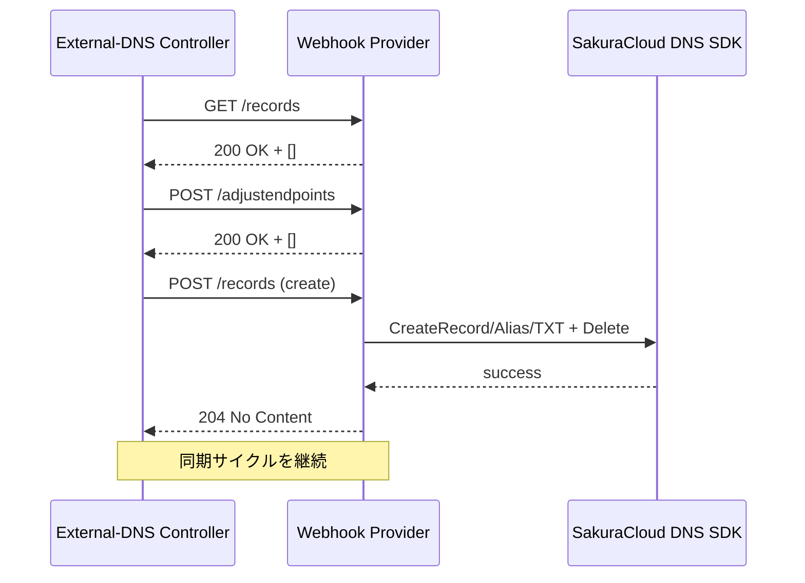
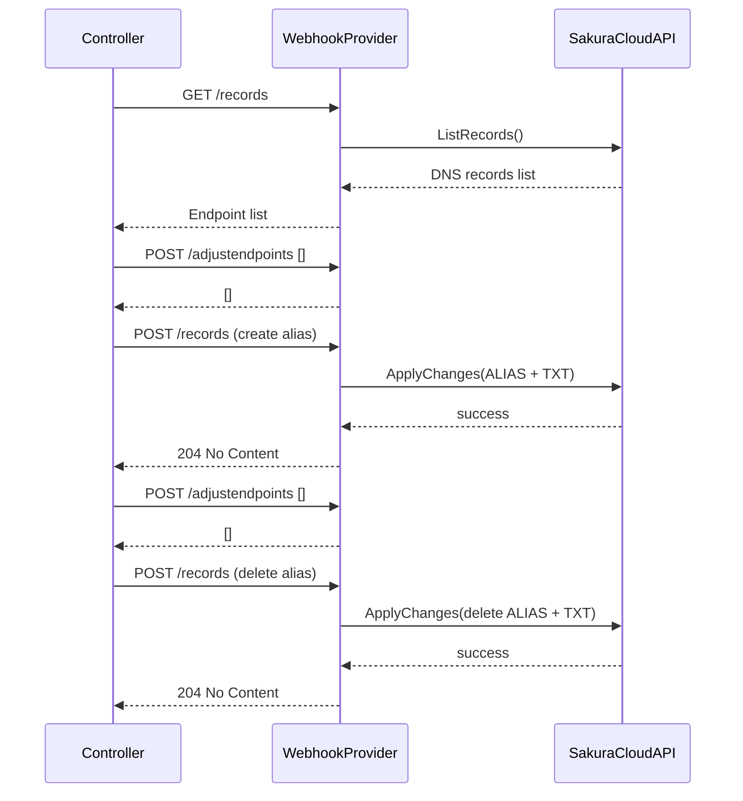

# SakuraCloud External-DNS Webhook Provider


[](https://github.com/sacloud/external-dns-sacloud-webhook/actions/workflows/release.yml)
[](https://discord.gg/yUEDN8hbMf)
[](https://github.com/sacloud/external-dns-sacloud-webhook/releases/latest)
[](https://github.com/sacloud/external-dns-sacloud-webhook/releases)
[](https://github.com/sacloud/external-dns-sacloud-webhook/releases)
[](https://github.com/sacloud/external-dns-sacloud-webhook/blob/main/LICENSE)
[](https://goreportcard.com/report/github.com/sacloud/external-dns-sacloud-webhook)

<p align="left">
  <a href="README.md">English</a> |
  <a href="README.ja.md">日本語</a>
</p>

ExternalDNS は Kubernetes リソースの DNS レコード管理を自動化するプラグインです。デフォルトでは Kubernetes はクラスター内部の DNS のみを扱いますが、ExternalDNS は外部の DNS プロバイダー（例：SakuraCloud、AWS Route 53、など）にレコードの同期を委任します。

本プロジェクトは SakuraCloud 向けの **Webhook プロバイダー** を実装しており、ExternalDNS が標準化された webhook 経由で SakuraCloud DNS ゾーンを管理できるようにします。公式の [ExternalDNS Webhook Provider 仕様](https://kubernetes-sigs.github.io/external-dns/v0.14.2/tutorials/webhook-provider) に完全準拠し、[既存の ExternalDNS](https://github.com/kubernetes-sigs/external-dns) デプロイメントにシームレスへ統合でき、将来のコミュニティドリブンな機能追加にも対応します。

> [!IMPORTANT]
> **アップグレードパスがこのセクションで示されている場合**、バージョンを飛ばさずに必ず順番に**適用**してください！これを無視すると、一貫性の欠如やエラーが発生する可能性があります。

> [!WARNING]
> **ご利用前に、本プロバイダーの [制限事項](#制限事項) を必ずご確認ください！**

## 特徴

* `sacloud/iaas-api-go` および `sacloud/iaas-service-go` SDK を活用
* ExternalDNS 仕様に準拠したフル Webhook プロバイダー
* ALIAS レコード、TXT レジストリ、カスタムエンドポイント調整に対応
* Helm Chart 対応
* 単体テストおよび CI/CD ワークフローを完備

## 対応プラットフォーム

* アーキテクチャ: `amd64`, `arm64`
* Kubernetes バージョン: `>=1.20`
* ExternalDNS バージョン: `v0.18.0` までサポート

## 要件

* SakuraCloud API Token & Secret
* 既存の SakuraCloud DNS ゾーン

> [!NOTE]
> 詳細は以下リンクを参照してください:
>
> * [SakuraCloud API Key](https://manual.sakura.ad.jp/cloud/api/apikey.html#apikey)
> * [SakuraCloud DNS](https://manual.sakura.ad.jp/cloud/appliance/dns/index.html)

## インストール

### 0. リリースのダウンロード

[Releases](https://github.com/sacloud/external-dns-sacloud-webhook/releases) からバイナリまたは Docker イメージを取得。

### 1. 設定オプション

| フラグ              | 環境変数                   | 説明                                      | 必須  | デフォルト     |
| ---------------- | ---------------------- | --------------------------------------- | --- | --------- |
| `--zone-name`    | `WEBHOOK_ZONE_NAME`    | SakuraCloud DNS ゾーン名 (例: `example.com`) | Yes |           |
| `--token`        | `WEBHOOK_TOKEN`        | SakuraCloud API Token                   | Yes |           |
| `--secret`       | `WEBHOOK_SECRET`       | SakuraCloud API Secret                  | Yes |           |
| `--provider-url` | `WEBHOOK_PROVIDER_URL` | Webhook リッスンアドレス                        | No  | `0.0.0.0` |
| `--port`         | `WEBHOOK_PORT`         | Webhook リッスンポート                         | No  | `8080`    |
| `--registry-txt` |                        | TXT レジストリモードを有効化                        | No  | `false`   |
| `--txt-owner-id` |                        | TXT レジストリのオーナー ID                       | No  | `default` |

### 2. デプロイメント

#### 2-1. クイックデプロイスクリプト

`example/reset-and-deploy.sh` を使うと以下を自動実行します:

1. 既存のテストリソースを削除
2. Webhook プロバイダーをデプロイ
3. ExternalDNS コントローラーをデプロイ
4. サンプルアプリと Ingress ルールをデプロイ

**使用手順:**

1. スクリプト冒頭の環境変数(TOKEN, SECRET, ZONE など)やサンプルアプリの target を編集
2. プロジェクトルートで以下を実行:

   ```bash
   bash example/reset-and-deploy.sh
   ```
3. 各ステップのログが表示され、リソースが順次再作成されます
4. 完了後、以下コマンドで状態を確認:

   ```bash
   kubectl get pod -n <namespace>
   kubectl get ingress -n <namespace>
   ```

> [!NOTE]
> デフォルトは `default` Namespace を使用します。必要に応じて変更してください。

> [!WARNING]
> 本スクリプトはテスト・開発用途向けです。本番環境への使用は推奨しません。

#### 2-2. Helm Chart (準備中)

## アーキテクチャフロー



## ALIAS サポート



## 制限事項

- A、CNAME、および TXT レコードタイプのみをサポート
- 現在、この webhook では SakuraCloud の AAAA および MX レコードはサポートされていない
- SakuraCloud DNS API は 1 レコードにつき 1 つのターゲット (RData) のみをサポートしている
- 同じ名前・タイプで複数の値 (A/TXT など) を登録はできない
- 複数値が必要な場合は、レコードを分割して登録してください

## License

`external-dns-sacloud-webhook` Copyright (C) 2025- The sacloud/external-dns-sacloud-webhook authors.
This project is published under [Apache 2.0 License](LICENSE).

---
