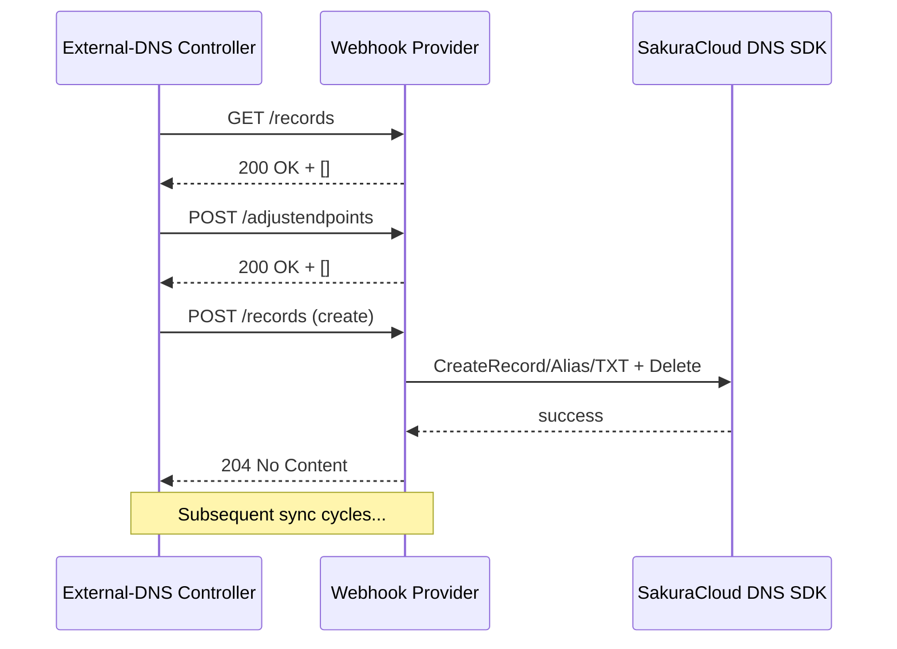
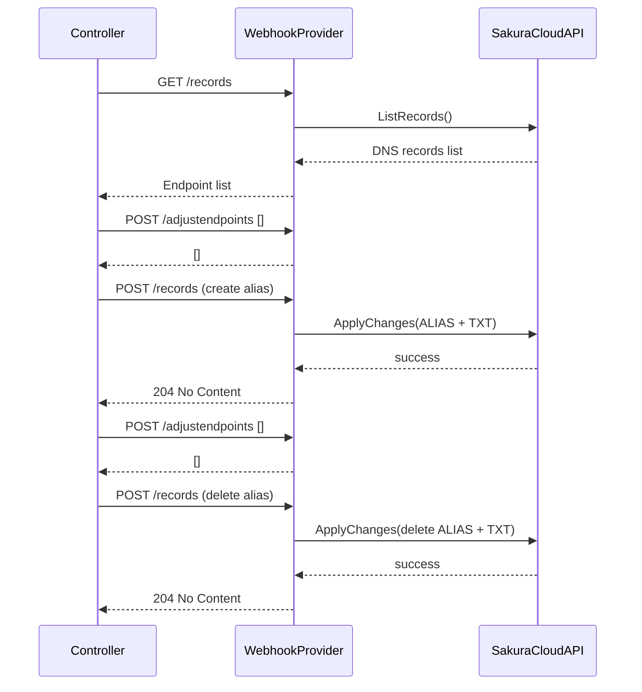

# SakuraCloud External-DNS Webhook Provider


[](https://github.com/sacloud/external-dns-sacloud-webhook/actions/workflows/release.yml)
[](https://discord.gg/yUEDN8hbMf)
[](https://github.com/sacloud/external-dns-sacloud-webhook/releases/latest)
[](https://github.com/sacloud/external-dns-sacloud-webhook/releases)
[](https://github.com/sacloud/external-dns-sacloud-webhook/releases)
[](https://github.com/sacloud/external-dns-sacloud-webhook/blob/main/LICENSE)
[](https://goreportcard.com/report/github.com/sacloud/external-dns-sacloud-webhook)

<p align="left">
  <a href="README.md">English</a> |
  <a href="README.ja.md">日本語</a>
</p>

ExternalDNS is a Kubernetes plugin for automating DNS record management for Kubernetes resources. By default, Kubernetes only handles internal cluster DNS. ExternalDNS delegates DNS record synchronization to external providers (e.g., [SakuraCloud](https://cloud.sakura.ad.jp/), AWS Route 53, etc.).

This project implements a **Webhook Provider** for SakuraCloud, allowing ExternalDNS to manage SakuraCloud DNS zones via standard webhook calls. It fully adheres to the [official ExternalDNS Webhook Provider specification](https://kubernetes-sigs.github.io/external-dns/v0.14.2/tutorials/webhook-provider), enabling seamless integration into any existing ExternalDNS deployment. For more details, see the official documentation: [kubernetes-sigs/external-dns](https://github.com/kubernetes-sigs/external-dns?tab=readme-ov-file#readme).

> [!IMPORTANT]
> **If** an **upgrade path** between versions is **listed here**, please make sure to follow those paths **without skipping a version**! Otherwise, inconsistencies or errors may occur.

> [!WARNING]
> **Please familiarize yourself with the [limitations](#limitations) before using this provider!**

## Features

* Leverages `sacloud/iaas-api-go` and `sacloud/iaas-service-go` SDKs
* Full Webhook Provider compliance with ExternalDNS specs
* Support for ALIAS records, TXT registry, and custom endpoint adjustment
* Minimal, container-friendly deployment (Helm Chart support coming)
* Comprehensive unit tests and CI/CD workflows

## Supported Platforms

* Architectures: `amd64`, `arm64`
* Kubernetes `>=1.20`
* ExternalDNS versions up to `v0.18.0`

## Requirements

* SakuraCloud API Token & Secret
* Existing DNS Zone in SakuraCloud
> [!NOTE]
> **For more information, please refer to the link below.**
> - [SakuraCloud API Key](https://manual.sakura.ad.jp/cloud/api/apikey.html#apikey)
> - [SakuraCloud DNS](https://manual.sakura.ad.jp/cloud/appliance/dns/index.html)

## Installation

### 0. Download Releases

Download pre-built binaries or Docker images from [Releases](https://github.com/sacloud/external-dns-sacloud-webhook/releases).

### 1. Configuration Options

| Flag             | Env Var                | Description                               | Required | Default   |
| ---------------- | ---------------------- | ----------------------------------------- | -------- | --------- |
| `--sakura-api-token`        | `SAKURA_API_TOKEN`        | SakuraCloud API Token                     | Yes      |           |
| `--sakura-api-secret`       | `SAKURA_API_SECRET`       | SakuraCloud API Secret                    | Yes      |           |
| `--zone-name`    | `ZONE_NAME`    | SakuraCloud DNS zone (e.g. `example.com`) | Yes      |           |
| `--provider-ip` | `PROVIDER_IP` | Webhook listen address                    | No       | `0.0.0.0` |
| `--provider-port`         | `PROVIDER_PORT`         | Webhook listen port                       | No       | `8080`    |
| `--registry-txt` |                        | Enable TXT registry mode                  | No       | `false`   |
| `--txt-owner-id` |                        | TXT registry owner ID                     | No       | `default` |
| `--config`         | `CONFIG_FILE_PATH`         | Path to configuration file (YAML format)  | No       |  |

### 2. Deployment

#### 2-1. Quick Deploy Script

Executes:

1. Delete existing test resources
2. Deploy Webhook Provider
3. Deploy ExternalDNS Controller
4. Deploy sample app and Ingress rules

Usage:
1.	Update the parameters at the top of `example/reset-and-deploy.sh`, including the SakuraCloud API Token, Secret, and DNS Zone name.
Then update the sample app’s target accordingly.
-	You can edit the environment variable assignments directly in the script header.
-	Ensure your Kubernetes cluster is properly configured and accessible.
2.	From the project root directory, run:

```bash
bash example/reset-and-deploy.sh
```

3.	The script will sequentially tear down and re-deploy all resources, printing detailed logs for each step.
4.	Upon completion, verify the deployed resources, for example:

```bash
kubectl get pod -n <namespace>
kubectl get ingress -n <namespace>
```

> [!NOTE]
> The script defaults to the default namespace; adjust as needed for your environment.

> [!WARNING]
> This script is intended for testing and development purposes only. Do not use it in production environments.

#### 2-2. Helm Chart (coming soon)

## Architecture Flow



## Advanced ALIAS Support



## Limitations

- Only supports A, CNAME, & TXT record types
- Currently SakuraCloud does not support AAAA or MX via this webhook
- SakuraCloud DNS API only supports a single target (RData) per DNS record. Multiple targets (e.g. multiple A or TXT values for the same name) are not supported; each must be a separate record.

## License

`external-dns-sacloud-webhook` Copyright (C) 2025- The sacloud/external-dns-sacloud-webhook authors.
This project is published under [Apache 2.0 License](LICENSE).

---
